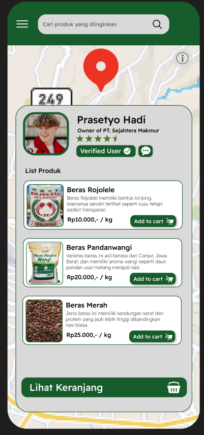
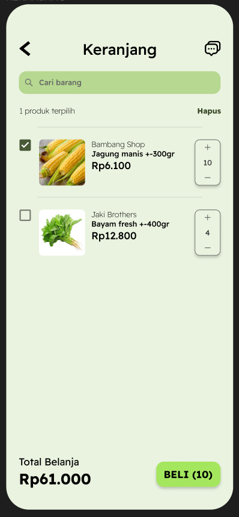

# Project HARVESTHUB

## Overview

Project HARVESTHUB is an innovative platform designed to streamline the process of product discovery, ordering, and communication between users and vendors. This repository contains the source code and comprehensive documentation to guide you through its features and functionalities.

## Screenshots

### Features

1. **Login**  
   Secure access to your account with a user-friendly login interface.  
   

2. **Find Product**  
   Effortlessly search for products using various filters to meet your needs.  
   

3. **Chat**  
   Communicate directly with vendors through an integrated chat feature for instant support.  
   

4. **Order Product**  
   Seamlessly place orders and track their status with our intuitive ordering system.  
   

## Team

Meet the amazing team behind Project HARVESTHUB:

- **Fausta Akbar Wijaya Nur Basuni**  
  **Role:** Hacker  
  Description: Skilled in backend development and problem-solving, contributing to the core functionalities of the application.

- **Rasendriya Abel Abhista Kristiawan**  
  **Role:** Hipster  
  Description: Focused on design and user experience, ensuring that the platform is aesthetically pleasing and easy to use.

- **Andre Aditya Amann**  
  **Role:** Hipster  
  Description: Collaborates on user interface design, bringing creative ideas to enhance user interaction.

- **Bryant Jonathan Gietosusilo**  
  **Role:** Hustler  
  Description: Drives project management and business strategies, ensuring that the project aligns with user needs and market trends.
