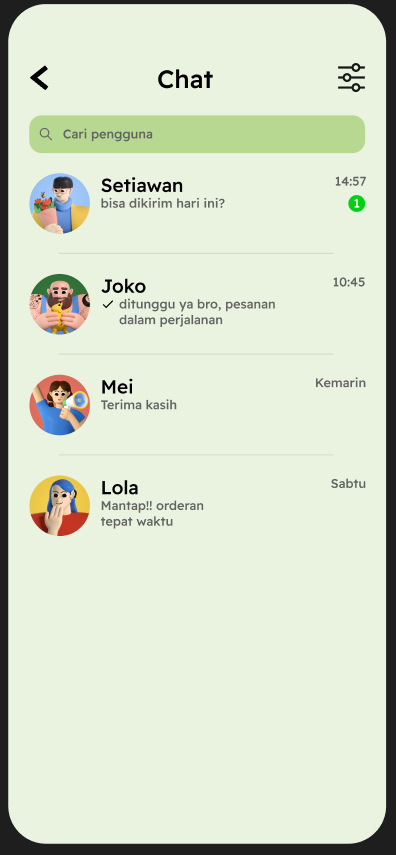

# 🌟 Project HARVESTHUB

## 🌐 Overview

Project HARVESTHUB is an innovative platform designed to streamline the process of **product discovery**, **ordering**, and **communication** between users and vendors. This repository contains the source code and comprehensive documentation to guide you through its features and functionalities.

## 📸 Screenshots

### 🛠 Features

1. **🔑 Login**  
   Secure access to your account with a user-friendly login interface.  
   

2. **🔍 Find Product**  
   Effortlessly search for products using various filters to meet your needs.  
   

3. **💬 Chat**  
   Communicate directly with vendors through an integrated chat feature for instant support.  
   

4. **🛒 Order Product**  
   Seamlessly place orders and track their status with our intuitive ordering system.  
   

## 👥 Team

Meet the amazing team behind Project HARVESTHUB:

- **Fausta Akbar Wijaya Nur Basuni**  
  **Role:** 🤖 Hacker  
  **Description:** Skilled in backend development and problem-solving, contributing to the core functionalities of the application.

- **Rasendriya Abel Abhista Kristiawan**  
  **Role:** 🎨 Hipster  
  **Description:** Focused on design and user experience, ensuring that the platform is aesthetically pleasing and easy to use.

- **Andre Aditya Amann**  
  **Role:** 🎨 Hipster  
  **Description:** Collaborates on user interface design, bringing creative ideas to enhance user interaction.

- **Bryant Jonathan Gietosusilo**  
  **Role:** 🚀 Hustler  
  **Description:** Drives project management and business strategies, ensuring that the project aligns with user needs and market trends.

## 🛠 Technologies Used

- **Framework:** Flutter
- **Programming Language:** Dart
- **State Management:** Provider / Riverpod
- **Backend:** Firebase / REST API (if applicable)
- **Database:** Firebase Firestore / SQLite (if applicable)
- **Chat Service:** Firebase Cloud Messaging / Socket.io (if applicable)

## 📦 Download APK

You can download the release APK for HARVESTHUB here: [Download HARVESTHUB APK](https://github.com/FaustaAkbar/HarvestHUB/releases/download/v1.0.0/app-release.apk)

## 📄 License

This project is licensed under the MIT License. Feel free to use, modify, and distribute this project as per the license terms.
